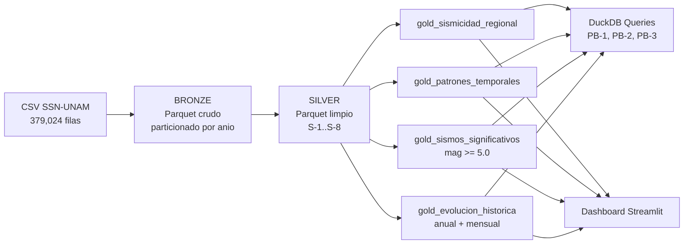
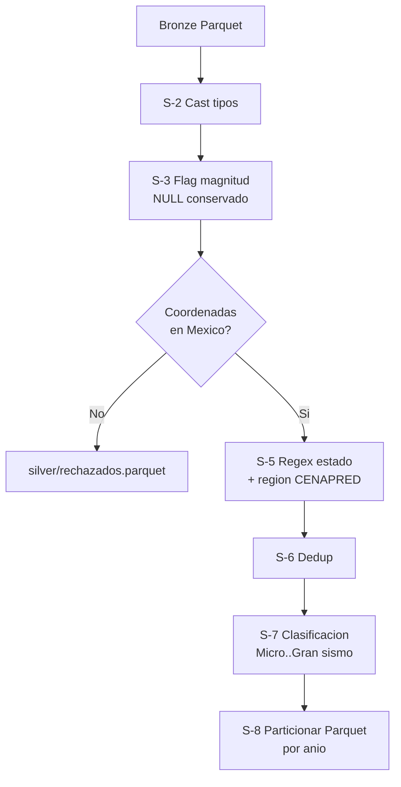

# Flujo Medallion — Diagrama

```mermaid
flowchart LR
    A[CSV SSN-UNAM<br/>379,024 filas] --> B[BRONZE<br/>Parquet crudo<br/>particionado por anio]
    B --> S[SILVER<br/>Parquet limpio<br/>S-1..S-8]
    S --> G1[gold_sismicidad_regional]
    S --> G2[gold_patrones_temporales]
    S --> G3[gold_sismos_significativos<br/>mag >= 5.0]
    S --> G4[gold_evolucion_historica<br/>anual + mensual]
    G1 --> Q[DuckDB Queries<br/>PB-1, PB-2, PB-3]
    G2 --> Q
    G3 --> Q
    G4 --> Q
    G1 --> D[Dashboard Streamlit]
    G2 --> D
    G3 --> D
    G4 --> D
```

## Pipeline Silver

```mermaid
flowchart TD
    B[Bronze Parquet] --> S2[S-2 Cast tipos]
    S2 --> S3[S-3 Flag magnitud<br/>NULL conservado]
    S3 --> S4{Coordenadas<br/>en Mexico?}
    S4 -- No --> R[silver/rechazados.parquet]
    S4 -- Si --> S5[S-5 Regex estado<br/>+ region CENAPRED]
    S5 --> S6[S-6 Dedup]
    S6 --> S7[S-7 Clasificacion<br/>Micro..Gran sismo]
    S7 --> S8[S-8 Particionar Parquet<br/>por anio]
```
